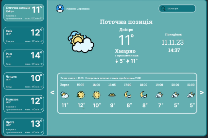
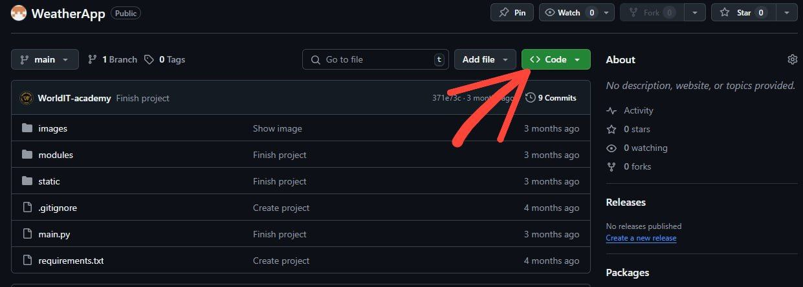
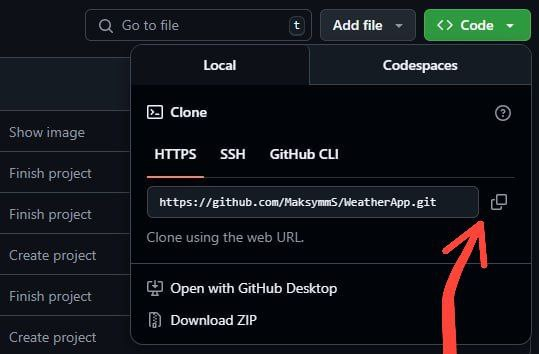
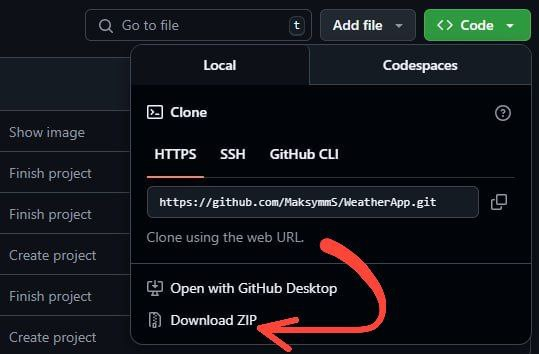

<h1>WEATHER APPLICATION</h1>

 
    Цей 
    проєкт розроблено з метою ознайомлення із роботою 
    <a href='https://developer.mozilla.org/en-US/docs/Glossary/API'>API</a>, 
    принципом отримання даних від віддаленого серверу, вмінням обробляти дані, структурувати та застосовувати у свому проєкті. А саме застосовувалось API такого веб-ресурсу як 
    <a href='https://openweathermap.org/'>OpenWeatherMap</a>.
    Проєкт допоможе розібратися у роботі файлів
    <a href='https://www.json.org/json-uk.html'>JSON</a>, 
    як правильно отримувати та зберігати дані у файлах з типом json. Та познайомить користувача з інтерфейсом застосунку розробленим за допомогою пакету 

```mermaid
    graph TD;
    WEATHERAPP-->images/;
    WEATHERAPP-->modules/;
    WEATHERAPP-->static/;
    WEATHERAPP-->.gitignore;
    WEATHERAPP-->main.py;
    WEATHERAPP-->README.md;
    WEATHERAPP-->requirements.txt;
    images/-->01d.png;
    images/-->01n.png;
    images/-->02d.png;
    images/-->02n.png;
    images/-->03d.png;
    images/-->03n.png;
    images/-->04d.png;
    images/-->04n.png;
    images/-->9d.png;
    images/-->9n.png;
    images/-->10d.png;
    images/-->10n.png;
    images/-->11d.png;
    images/-->11n.png;
    images/-->13d.png;
    images/-->13n.png;
    images/-->arrow_down.png;
    images/-->arrow_up.png;
    images/-->loope.png;
    modules/-->gui/;
    modules/-->__init__.py;
    modules/-->read_json.py;
    modules/-->weather_data.py;
    modules/-->write_json.py;
    gui/-->__init__.py;
    gui/-->city_weather.py;
    gui/-->forecast_component.py;
    gui/-->forecast_frame.py;
    gui/-->image.py;
    gui/-->main_info.py;
    gui/-->main_screen.py;
    gui/-->side_bar.py;
    static/-->icon/;
    static/-->config.json;
    static/-->forecast.json;
    static/-->weather_data.json;
    icon/-->activate.png;
    icon/-->activateMAC.png;
    icon/-->button.jpg;
    icon/-->copy.jpg;
    icon/-->module.png;
    icon/-->requirements.png;
    icon/-->screen.png;
    icon/-->virtual.png;
    icon/-->virtualMAC.png;
    icon/-->zip.jpg;         
```

    <a href='https://customtkinter.tomschimansky.com/'>CustomTkinter</a>.

<h2 id='content'>Зміст:</h2>
<ol>
    <li>
        <a href='#all-modules'>Модулі проєкту</a>.
    </li>
    <li>
        <a href='#download-project'>Розгортання проєкту</a>.
    </li>
    <li>
        <a href='#create-venv'>Створення віртуального оточення</a>.
        <ul>
            <li>
                <a href='#windows'>Для Windows</a>.
            </li>
            <li>
                <a href='#mac-os'>Для MacOS або Linux</a>.
            </li>
        </ul>
    </li>
    <li>
        <a href='#download-modules'>Завантаження модулей до віртуального проєкту</a>.
        <ul>
            <li>
                <a href='#requirements'>Завантаження requriments.txt</a>.
            </li>
            <li>
                <a href='#pip-install'>Завантаження окремих модулів</a>.
            </li>
        </ul>
    </li>
    <li>
        <a href='#start-project'>Старт проєкту</a>.
    </li>
    <li>
        <a href='#base-mechanics'>Основні механіки проєкту</a>.
    </li>
    <li>
        <a href='#result'>Висновок</a>.
    </li>
</ol>

<h3 id='all-modules'>Модулі проєкту:</h3>

- [customtkinter](https://customtkinter.tomschimansky.com/)
- [json](https://docs.python.org/3/library/json.html)
- [requests](https://pypi.org/project/requests/)
- [pillow](https://pillow.readthedocs.io/en/stable/)
- [os](https://docs.python.org/3/library/os.html)
- [colorama](https://pypi.org/project/colorama/)
- [datetime](https://docs.python.org/3/library/datetime.html)

___
<h3 id='download-project'>Розгортання проєкту:</h3>

1. Склонувати з <a href='https://github.com/MaksymmS/WeatherApp'>GitHub</a> репозиторію 

<h3>Натисніть на зелену кнопку "Code": </h3>

<h3>У відкрившомуся вікні скопіюйте https адресу: </h3>

    Далі 
    перейдіть до
    <a href='https://code.visualstudio.com/'>Visual Studio Code</a>, 
    та в терміналі <a href='https://www.atlassian.com/git/tutorials/git-bash'>GitBash</a> за допомогою команди git clone вставте посилання на <a href='https://github.com/MaksymmS/WeatherApp'>GitHub репозиторій</a>

2. Завантажити за допомогою zip-архіву
<h3>Натисніть на кнопку "Download ZIP", завантажте його та розпакуйте його:</h3>

<b><a href='#content'>До змісту⬆️</a></b>

___

<h3 id='create-venv'>Створення віртуального оточення:</h3>
<h1 id='windows'>Windows</h1>

 - <h5>У терміналі створить віртуальне оточення за прикладом:</h5>
    
    <pre><code>python -m venv venv</pre></code>

 - <h5>Активуйте його як показано на прикладі:</h5>

    <pre><code>.\venv\Scripts\Activate.ps1</pre></code>

<h1 id='mac-os'>MacOS/Linux</h1>

 - <h5>У терміналі створіть віртуальне оточення за прикладом:</h5>

    <pre><code>python3 -m venv venv</pre></code>

 - <h5>Активуйте віртуальне оточення:</h5>

    <pre><code>source venv/bin/activate</pre></code>

<b><a href='#content'>До змісту⬆️</a></b>

___

<h3 id='download-modules'>Завантаження модулів до віртуального оточення:</h3>

<h1 id='requirements'>Завантаження модулів через requirements.txt:</h1>

 - <h5>Завантажте усі модулі з requirements.txt, за допомогою команди pip install -r</h5>

    <pre><code>pip install -r requirements.txt</pre></code>

<h1 id='pip-install'>Завантаження окремих модулів:</h1>

 - <h5>У терміналі пишіть до кожного модуля pip install якого потрибує система:</h5>

    <pre><code>pip install customtkinter</pre></code>

<b><a href='#content'>До змісту⬆️</a></b>
___

<h1 id='start-project'>Старт проєкту:</h1>

 - <h5>Щоб запустити проєкст у терміналі напишіть команду: <pre><code>python main.py</pre></code></h5>

<b><a href='#content'>До змісту⬆️</a></b>
___

<h1 id='base-mechanics'>Основні механіки проєкту:</h1>

Отримання данних з <a href='https://openweathermap.org/'>OpenWeatherMap</a> працює за допомогою API, котре ми отримуємо та зберигаємо в данном випадку в <a href='https://www.json.org/json-en.html'>JSON</a> форматі.
GUI реальзовано за допомогою <a href='https://customtkinter.tomschimansky.com/'>CustomTkinter</a>.

<b><a href='#content'>До змісту⬆️</a></b>
___

<h1 id='result'>Висновок:</h1>
За допомогою 
цього проєкта я ознайомився з понятєм як створит власний Descktop застосунок. 

А саме:
<b>

 - як працювати с requests;
 - як отримувати данні з від віддаленого серверу, за допомогою <a href='https://aws.amazon.com/what-is/api/#:~:text=on%20your%20phone.-,What%20does%20API%20stand%20for%3F,of%20service%20between%20two%20applications.'>API</a> та зберігати  у <a href='https://www.json.org/json-en.html'>JSON</a> форматі;
 - як створювати додатки через <a href='https://customtkinter.tomschimansky.com/'>CustomTkinter</a>;
 - як розробити свої власні графічні інтерфейси, а також дизайни.

<a href='#content'>До змісту⬆️</a></b>

